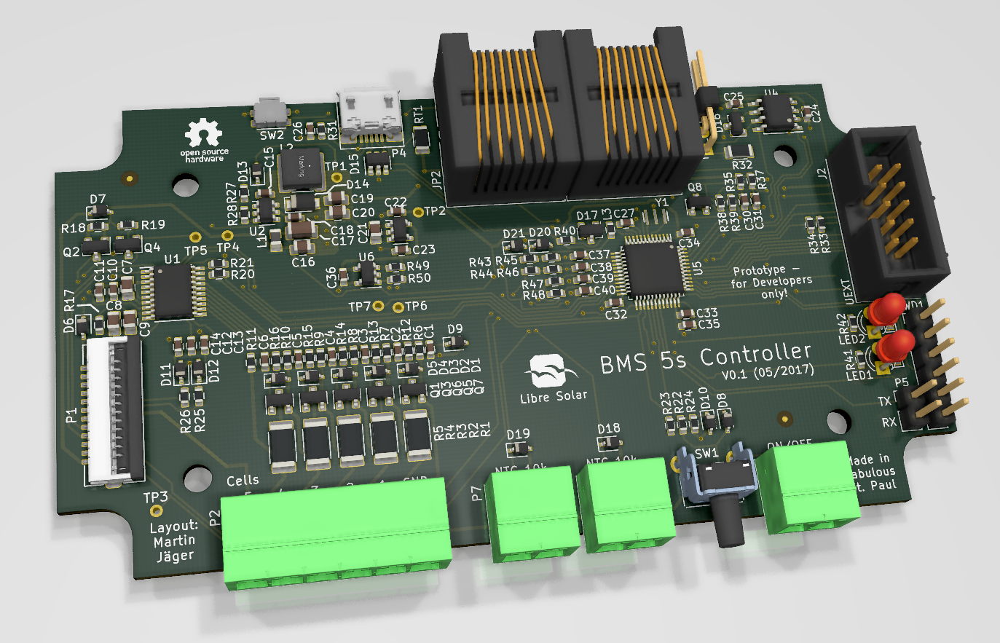
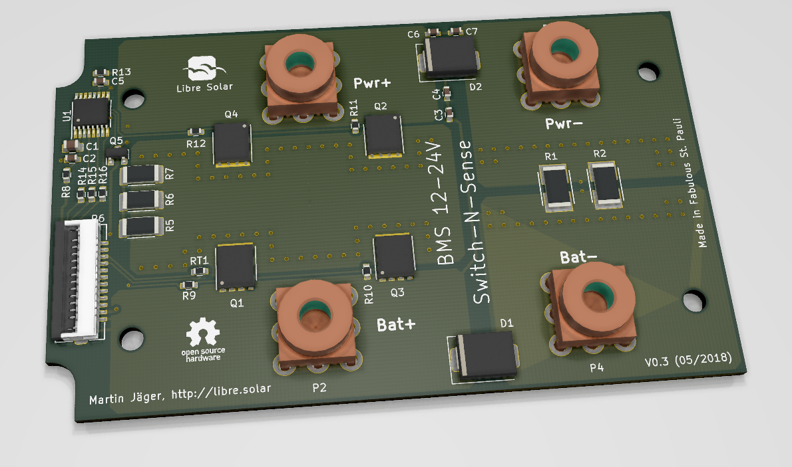
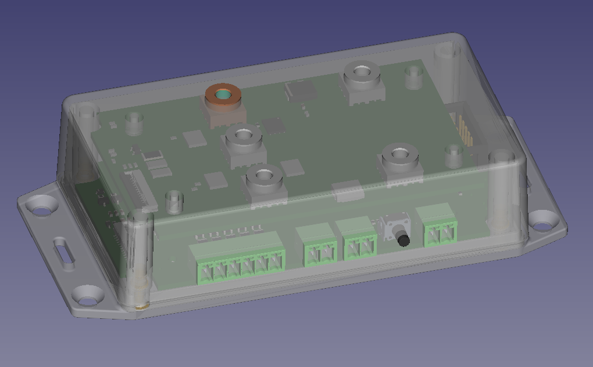

# BMS 5s (12 V)

Battery management system for up to 5 Li-ion cells based on bq76920 IC from Texas Instruments

## Boards

The Libre Solar BMS is divided into two different boards, connected via a flat cable and integrated into one housing.

### Control board (BMS 5s)

### Power board (Switch-N-Sense)

## Features

- 3 to 5 Li-ion cells (e.g. LiFePO4)
- 50 A maximum current
- Balancing current approx. 150 mA
- STM32F072 ARM Cortex M0 microcontroller
- Built-in CAN communication interface and UEXT extension connector

## Housing

The BMS should fit into a Hammond Mfg 1591XXBFL housing as shown in below picture. The picture shows the BMS controller PCB with the Switch-N-Sense power PCB stacked on top of it:

## History

- There is [another version of the BMS](https://github.com/LibreSolar/BMS48V)  supporting more cells and developed in Eagle CAD. This one is the first of the new BMS generation developed in KiCad. An updated version of the versions with higher number of cells might come soon.

## Important Notice

The PCBs have not been tested regarding EMC and other regulations. If you reproduce the boards, you use them at your own risk and responsibility.
